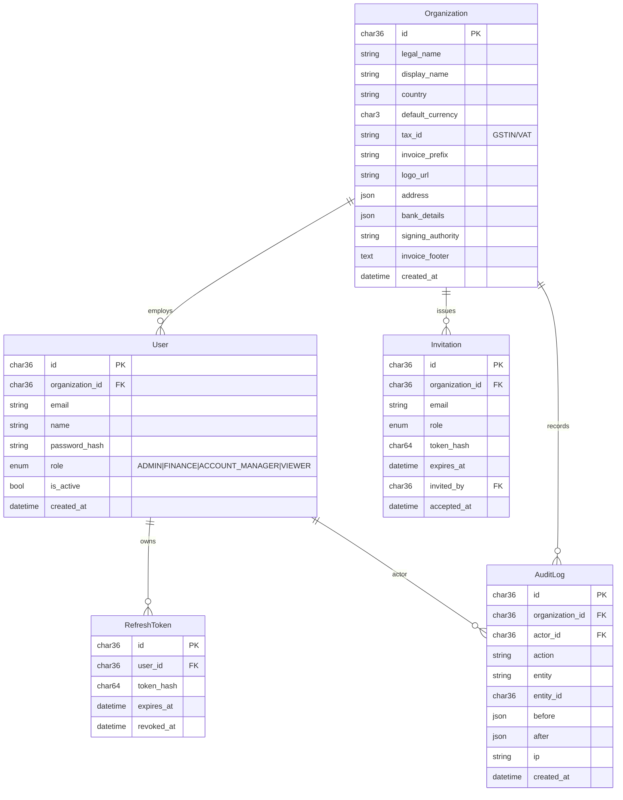

# Data Model — v1

> Authoritative ER diagram for the platform. Slice 1 implements the bold tables.

## Entities

- **Organization** (operator tenant root)
- **User** (operator's staff)
- **Invitation** (pending team invite)
- **RefreshToken** (rotated, hashed)
- **AuditLog** (who/what/when, before+after JSON)
- Client, Contact, Tag — Slice 2
- Product, Plan, PricingTier — Slice 3
- Subscription, SubscriptionEvent, Coupon — Slice 4
- Reminder, Task, ComplianceTemplate, ComplianceItem — Slices 5/8
- Invoice, InvoiceLineItem, InvoiceSequence, Payment, Currency — Slices 6/7

## Conventions

| Concern | Rule |
|---|---|
| Tenancy | every business row has `organization_id` (indexed, FK, not null) |
| Money | `BIGINT` minor units (paise/cents) + `CHAR(3)` ISO currency |
| Time | UTC in DB (`DATETIME(6)`), rendered in user TZ |
| Soft delete | `deleted_at DATETIME(6) NULL` + global query filter |
| Audit | `created_at`, `created_by`, `updated_at`, `updated_by` on every row |
| IDs | UUID v4 (`CHAR(36)`) |
| Idempotency | `idempotency_key` column on scheduler-produced rows; unique index |

## ER (Slice 1 scope)

